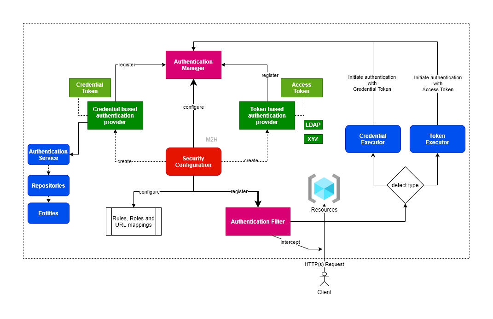

#1. Generate pk12 keystore
## 1.1 Generate key and certificate
> **openssl req** -x509 **-newkey** rsa:4096 **-keyout** ms-workshop-key.pem **-out** ms-workshop-cert.pem **-days** 365

Generating a RSA private key
.....................................................................................................................................................................................................................................++++
...............................................................................................................++++

writing new private key to 'ms-workshop-key.pem'

Enter PEM pass phrase:

Verifying - Enter PEM pass phrase:
Country Name (2 letter code) [AU]:pk

State or Province Name (full name) [Some-State]:punjab
Locality Name (eg, city) []:lahore

Organization Name (eg, company) [Internet Widgits Pty Ltd]:expertwall

Organizational Unit Name (eg, section) []:dev

Common Name (e.g. server FQDN or YOUR name) []:mazhar hassan

Email Address []:doctor_nett at yahoo.com

## 1.2 Generate pk12 keystore
pk12 support both key and certificate to be imported in

>  **openssl pkcs12 -export -in** ms-workshop-cert.pem **-inkey** ms-workshop-key.pem **-name** expertwall **-out** ms-workshop-PKCS-12.p12

## 2.3 Set properties
`
p12.keystore.password=${keystorePassword:mazhar}
p12.keystore.alias=${keystoreAlias:expertwall}`

# 2. Security - Important entities
